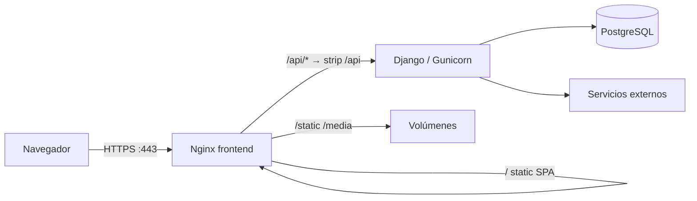
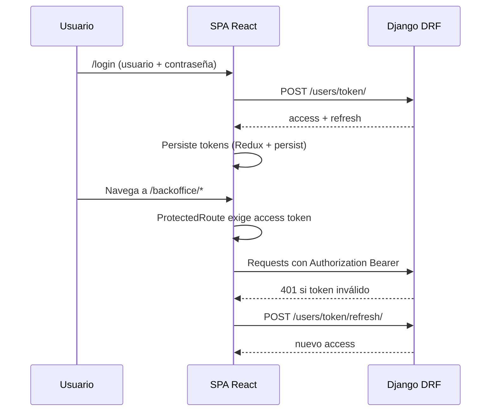
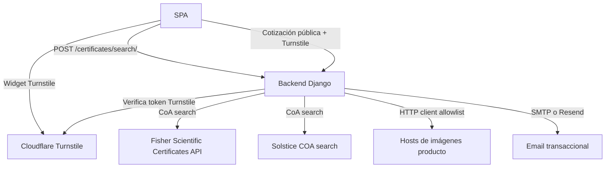
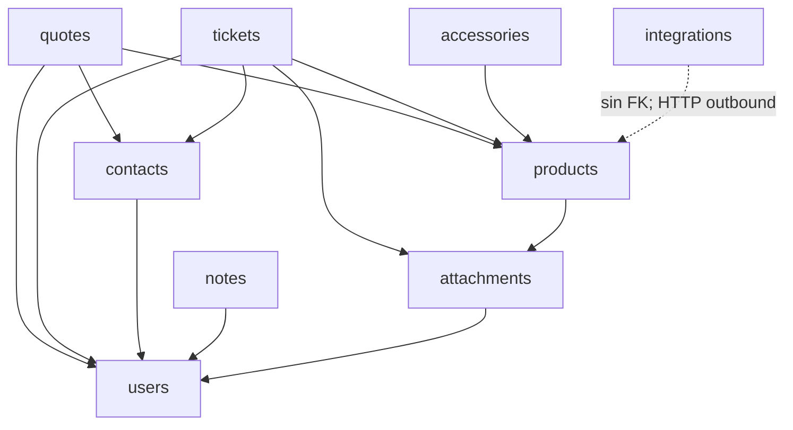
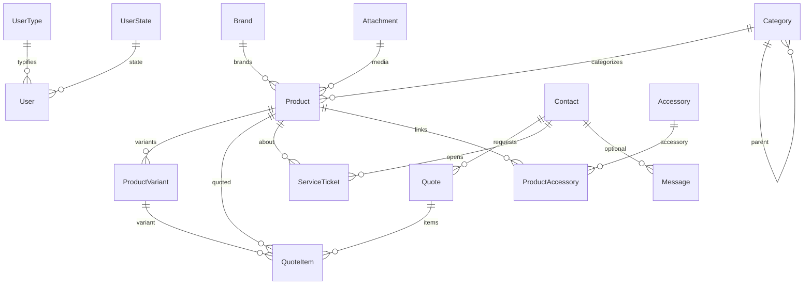

# Manual técnico de arquitectura — Laqq

**Fuente de verdad:** código del monorepo (Django + SPA React).  
**Supersede parcial:** este documento prevalece sobre `Backend/docs/ARCHITECTURE.md` y `Backend/docs/API.md` cuando hay contradicción (ver [§7](#7-docs-legadas-desactualizadas)).

---

## 1. Visión general

Laqq (La Química Quirúrgica) es un monorepo con:

| Capa | Tecnología | Ubicación |
|------|------------|-----------|
| API | Django 4.2 + DRF + SimpleJWT + PostgreSQL 15 | `Backend/` |
| SPA | Vite + React 18 + TypeScript + Redux Toolkit + TanStack Query + Tailwind | `Frontend/` |
| Orquestación | Docker Compose v2 | `docker-compose.dev.yml`, `docker-compose.prod.yml` |
| Proxy prod | Nginx (SPA + `/api` → backend + static/media) | `Frontend/nginx.conf` |

**Una sola SPA** cubre:

- **Sitio público / panel comercial:** catálogo, cotizaciones, contacto, certificados CoA, servicio técnico, etc.
- **Backoffice:** rutas bajo `/backoffice/*`, protegidas por JWT.

No hay aplicación separada de “pedidos” ni “facturación”. El flujo comercial de solicitud es **cotizaciones** (`quotes`).

---

## 2. Diagramas

### 2.1 Arquitectura de alto nivel (producción)

En desarrollo, el frontend (Vite `:3000`) y el backend (`:8000`) se exponen por separado; Postgres en host `localhost:5433`.

### 2.2 Flujo de autenticación JWT

- Login real: `POST /users/token/` (credenciales `username` / `password`).
- En producción detrás de Nginx: el cliente llama `/api/users/token/` (el prefijo `/api/` se elimina al proxy).
- `ProtectedRoute` solo verifica presencia de token; **no** filtra por rol a nivel de ruta. Los roles se aplican en API (DRF) y en UI con hooks `useCan*`.

### 2.3 Integraciones externas reales

| Integración | Código | Endpoint / uso |
|-------------|--------|----------------|
| Certificados CoA | `Backend/integrations/certificates/` | `POST /certificates/search/` (`fisher` \| `solstice`) |
| Cliente HTTP | `Backend/integrations/http/` | Descarga imágenes en bulk upload de productos |
| Turnstile | `quotes/turnstile.py` + FE | Cotizaciones públicas |
| Email | SMTP y/o `RESEND_API_KEY` | Contactos, cotizaciones, tickets |
| Adjuntos | `attachments/` | Binarios Base64 / galería |

**No implementado:** integración BAS / CS WebAPI (no hay código ni stubs).

---

## 3. Módulos backend y dependencias

Montaje de URLs en `Backend/config/urls.py`:

| Prefijo | App | Responsabilidad |
|---------|-----|-----------------|
| `/users/` | `users` | Usuarios, tipos, estados, JWT |
| `/products/` | `products` | Catálogo, marcas, categorías, variantes, specs, bulk |
| `/accessories/` | `accessories` | Accesorios y vínculo producto–accesorio |
| `/contacts/` | `contacts` | Contactos CRM + mensajes web |
| `/quotes/` | `quotes` | Cotizaciones e ítems |
| `/notes/` | `notes` | Notas / novedades |
| `/tickets/` | `tickets` | Tickets de servicio técnico |
| `/attachments/` | `attachments` | Galería / adjuntos genéricos (GFK) |
| `/certificates/` | `integrations.certificates` | Proxy CoA |
| `/dashboard/summary/` | `config.dashboard` | Resumen backoffice |

### Dependencias entre dominios

- `config`: settings, JWT, CORS/CSRF, dashboard, mail helpers.
- `integrations` no es app de modelos de negocio; encapsula HTTP outbound y certificados.

---

## 4. Mapa frontend

Fuente: `Frontend/src/App.tsx`, menú activo en `Frontend/src/components/layout/Sidebar.tsx`.

### 4.1 Sitio público (`MainLayout`)

| Ruta | Función |
|------|---------|
| `/` | Home |
| `/products` | Catálogo |
| `/product/:id` | Detalle de producto |
| `/marcas/:slug` | Página de marca |
| `/quote` | Solicitar cotización (carrito + formulario) |
| `/support` | Servicio técnico |
| `/certificates` | Búsqueda de certificados CoA |
| `/furniture` | Mobiliario |
| `/company` | Empresa |
| `/contact` | Contacto |
| `/login` | Acceso BackOffice |
| `/tickets` | Portal cliente de tickets (sin `MainLayout`) |

### 4.2 Backoffice (`ProtectedRoute` + `BackofficeLayout`)

Menú **activo** del Sidebar:

| Ruta | Label UI |
|------|----------|
| `/backoffice` | Dashboard |
| `/backoffice/users` | Usuarios |
| `/backoffice/products` | Productos |
| `/backoffice/quotes` | Cotizaciones |
| `/backoffice/messages` | Mensajes |
| `/backoffice/brands` | Marcas |
| `/backoffice/categories` | Categorías |
| `/backoffice/contacts` | Contactos |
| `/backoffice/tickets` | Tickets de servicio |
| `/backoffice/libreria` | Librería |

Rutas existentes pero **fuera del menú** (comentadas o complementarias): `notes`, `complementary/*` (states, types, levels, rrhh, accessories).

---

## 5. Roles y permisos (modelo real)

### 5.1 Tipos de usuario

Seed (`populate_user_data`):

| `user_type_id` | Uso |
|----------------|-----|
| `admin` | Administración completa |
| `back` | Backoffice operativo (cotizaciones, lectura amplia; escritura acotada) |
| `client` | Cliente (p. ej. portal de tickets propios) |

Modelo: `User` → FK `UserType`, `UserState`.  
`UserType.permissions` es un **JSON descriptivo** en seed; **no** hay motor RBAC que evalúe strings tipo `users_read` / `products_write`.

**No hay** modelos `Role` / `Permission` / `RolePermission` activos.  
`django_otp` está en `INSTALLED_APPS`, pero el flujo de login de la SPA **no** implementa 2FA de producto.

### 5.2 Cómo se aplica

| Capa | Mecanismo |
|------|-----------|
| Backend | Clases DRF en `*/permissions.py` + chequeos `user.user_type_id` / `is_superuser` |
| Frontend rutas | `ProtectedRoute`: solo JWT |
| Frontend UI | `Frontend/src/hooks/usePermissions.ts` (`useCanManageProducts`, `useCanManageQuotes`, etc.) |

### 5.3 Matriz por módulo (resumen)

Leyenda: ● completo · ◐ parcial / lectura · ○ no / público sin auth · — N/A

| Módulo | Público (anon) | `client` | `back` | `admin` |
|--------|----------------|----------|--------|---------|
| Catálogo productos (GET) | ● | ● | ● | ● |
| ABM productos / marcas / categorías | ○ | ○ | ◐ lectura; sin write UI | ● |
| Export Excel productos | ○ | ○ | ● | ● |
| Crear cotización web | ● (+ Turnstile) | ● | ● | ● |
| Gestionar cotizaciones BO | ○ | ○ | ● | ● |
| Mensajes contacto (POST) | ● | ● | ● | ● |
| Mensajes BO / eliminar | ○ | ○ | ◐ ver | ● |
| Contactos CRM | ○ | ○ | ◐ crear; sin editar/borrar UI | ● |
| Tickets crear web | ● | ● | ● | ● |
| Tickets ver | ○ | ◐ propios | ● todos | ● |
| Tickets workflow assign/start/resolve/close | ○ | ○ | ○ | ● |
| Adjuntos galería write | ○ | ○ | ○ | ● |
| Usuarios ABM | ○ | ○ | ○ (auth sí, UI manage no) | ● |
| Certificados CoA search | ● | ● | ● | ● |
| Dashboard summary | ○ | según API auth | ● | ● |

Detalle fino: ver clases en `products/permissions.py`, `quotes/permissions.py`, `tickets/permissions.py`, `attachments/permissions.py` y hooks FE.

---

## 6. Modelo de datos (alto nivel)

Entidades clave:

- **Catálogo:** `Brand`, `Category` (árbol), `Product`, `ProductVariant`, `TechnicalSpec` (+ tablas puente).
- **Comercial:** `Quote` / `QuoteItem` ligados a `Contact` y productos.
- **Servicio:** `ServiceTicket` ligado a `Contact`, opcionalmente producto y adjuntos; estados y prioridades de catálogo.
- **CRM ligero:** `Contact`, `Message`.
- **Media:** `Attachment` (GenericFK a distintos dueños + galería).
- **Auth:** `User` + `UserType` + `UserState`.

---

## 7. Docs legadas desactualizadas

| Documento | Problema | Qué prevalece |
|-----------|----------|---------------|
| `Backend/docs/ARCHITECTURE.md` | Habla de frontend “futuro”, modelos Role/Permission, 2FA de producto, permisos granulares | Este manual + código |
| `Backend/docs/API.md` | Login en `/api/auth/login/` con email; refresh `/api/auth/refresh/`; roles string | Rutas reales: `/users/token/`, `/users/token/refresh/`; roles `admin`/`back`/`client` |
| `docs/integrations.md` | Útil, pero mencionar token en `/api/token/` es impreciso | Prefijo real `/users/token/` (con `/api` solo vía Nginx) |

Para contrato HTTP actualizado: Swagger (`ENABLE_API_DOCS=True`, staff) + `Backend/docs/PUBLIC_ENDPOINTS.md` + routers en cada app.

---

## Referencias de código

- URLs: `Backend/config/urls.py`
- Settings / JWT / env: `Backend/config/settings.py`
- Rutas FE: `Frontend/src/App.tsx`
- Sidebar: `Frontend/src/components/layout/Sidebar.tsx`
- Permisos FE: `Frontend/src/hooks/usePermissions.ts`
- Compose: `docker-compose.prod.yml`, `docker-compose.dev.yml`
