# Manual de usuario — Laqq (Sitio + Backoffice)

Guía de uso alineada al producto actual.  
**No implementado:** pedidos ni facturación. El flujo comercial de solicitud es **cotizaciones**.

Capturas en `docs/screenshots/`. Checklist en `docs/screenshots/README.md`. Regenerar: `cd Frontend && npm run screenshots:manual`.

---

## Roles (resumen para el usuario)

| Rol | Acceso típico |
|-----|----------------|
| Visitante | Sitio público, cotización, contacto, certificados, abrir ticket |
| `client` | Además: consultar tickets propios (portal `/tickets`) |
| `back` | Backoffice: gestiona cotizaciones; ve catálogo/tickets; escritura limitada |
| `admin` | Backoffice completo (usuarios, productos, marcas, categorías, tickets workflow, librería, etc.) |

El menú `/backoffice` exige login. La UI oculta acciones según rol; el servidor valida de nuevo.

---

# A. Sitio público / panel comercial

## A.1 Login (acceso BackOffice)

**Objetivo:** autenticarse para entrar al panel de administración.

1. Ir a `/login`.
2. Completar **Usuario** y **Contraseña**.
3. Pulsar **Ingresar**.
4. Si las credenciales son válidas, se redirige al backoffice.

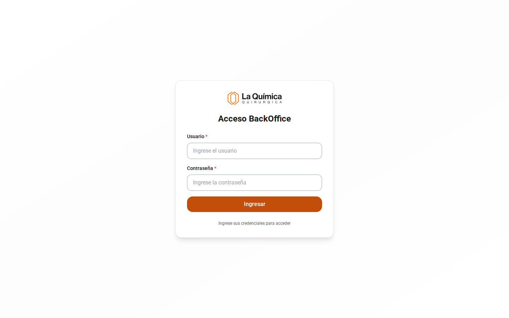

**Notas:** El título de la pantalla es **Acceso BackOffice**. Sin token no se puede abrir `/backoffice/*` (redirección a login).

---

## A.2 Catálogo de productos

**Objetivo:** explorar equipos y material de laboratorio.

1. Ir a **Catálogo** / ruta `/products`.
2. Usar filtros por categoría o marca si están activos (chips *Filtrando por…*).
3. Abrir un producto para ver el detalle.

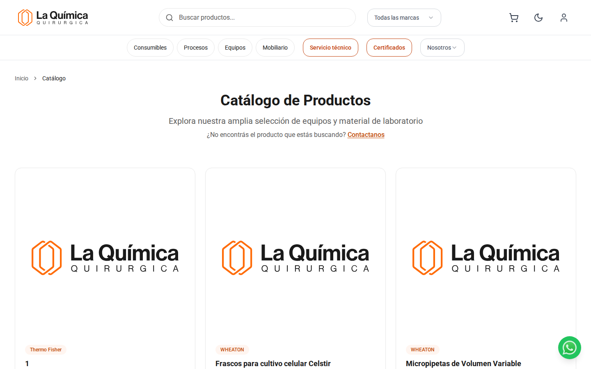

---

## A.3 Detalle de producto

**Objetivo:** ver fichas, variantes y pedir cotización.

1. Desde el catálogo, abrir un ítem (`/product/:id`).
2. Revisar **Especificaciones técnicas** y **Productos relacionados**.
3. Si hay variantes, usar **Elegir variante**.
4. **Agregar al carrito** y/o **Solicitar Cotización**.

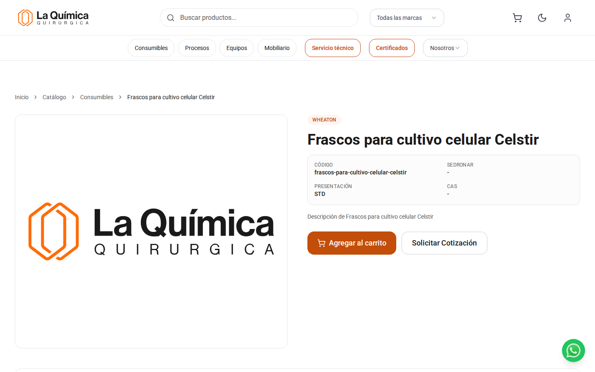

**Errores comunes:** *Producto no encontrado* → volver con **Volver al Catálogo**.

---

## A.4 Página de marca

**Objetivo:** ver el catálogo filtrado por marca (`/marcas/:slug`).

1. Acceder desde navegación o URL de marca.
2. Explorar productos de esa marca.

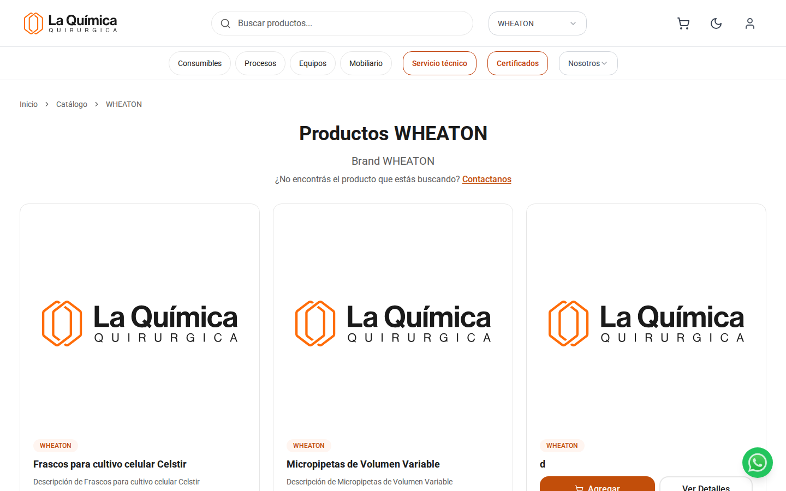

---

## A.5 Solicitar cotización

**Objetivo:** enviar una solicitud comercial (reemplaza “pedidos” en este sistema).

1. Ir a `/quote` (**Solicitar Cotización**).
2. Revisar ítems del carrito / formulario.
3. Completar datos de contacto.
4. Completar el desafío **Turnstile** (antispam) si aparece.
5. Pulsar **Enviar Solicitud**.

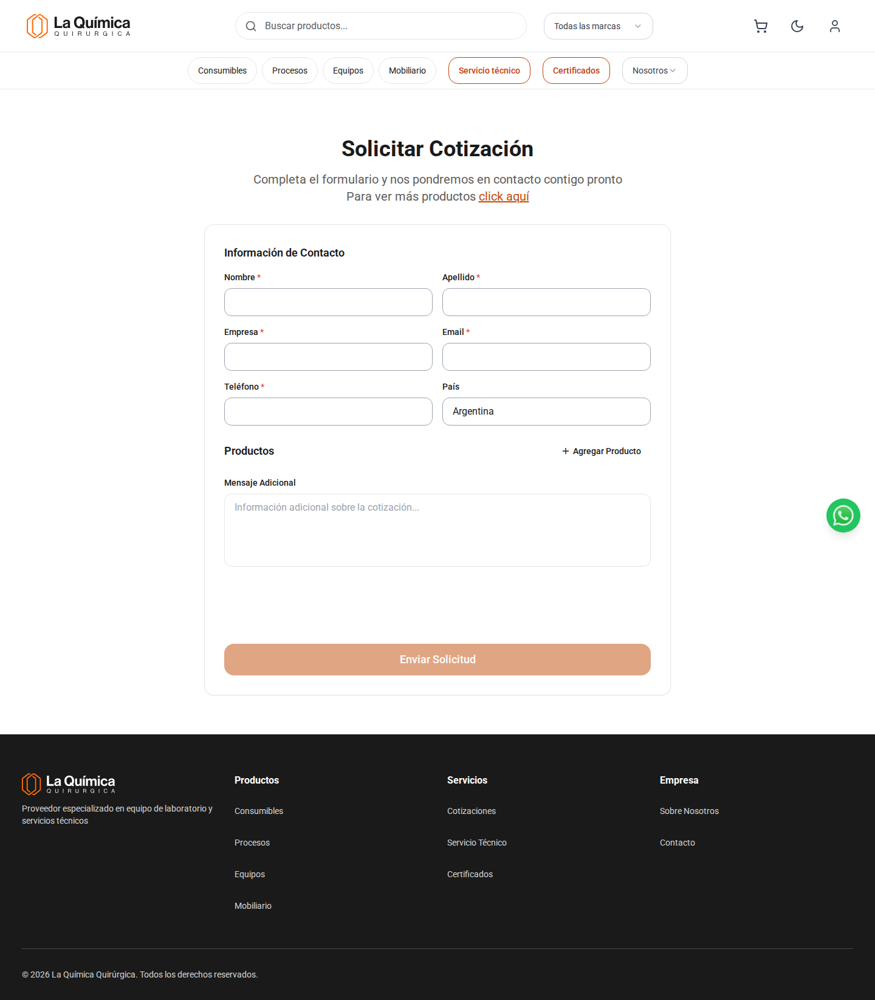

**Notas:** La creación es pública vía API. El equipo la gestiona después en **Cotizaciones** del backoffice. No hay facturación en la app.

---

## A.6 Servicio técnico y tickets

**Objetivo:** abrir o consultar tickets de soporte.

1. Ir a `/support` (**Servicio Técnico**).
2. **Abrir Nuevo Ticket** → **Crear Ticket**, o **Consultar Estado** → **Ver Mis Tickets**.
3. Seguir la **Guía Rápida** si hace falta.
4. Portal cliente: `/tickets` para listar tickets asociados al contacto/email.

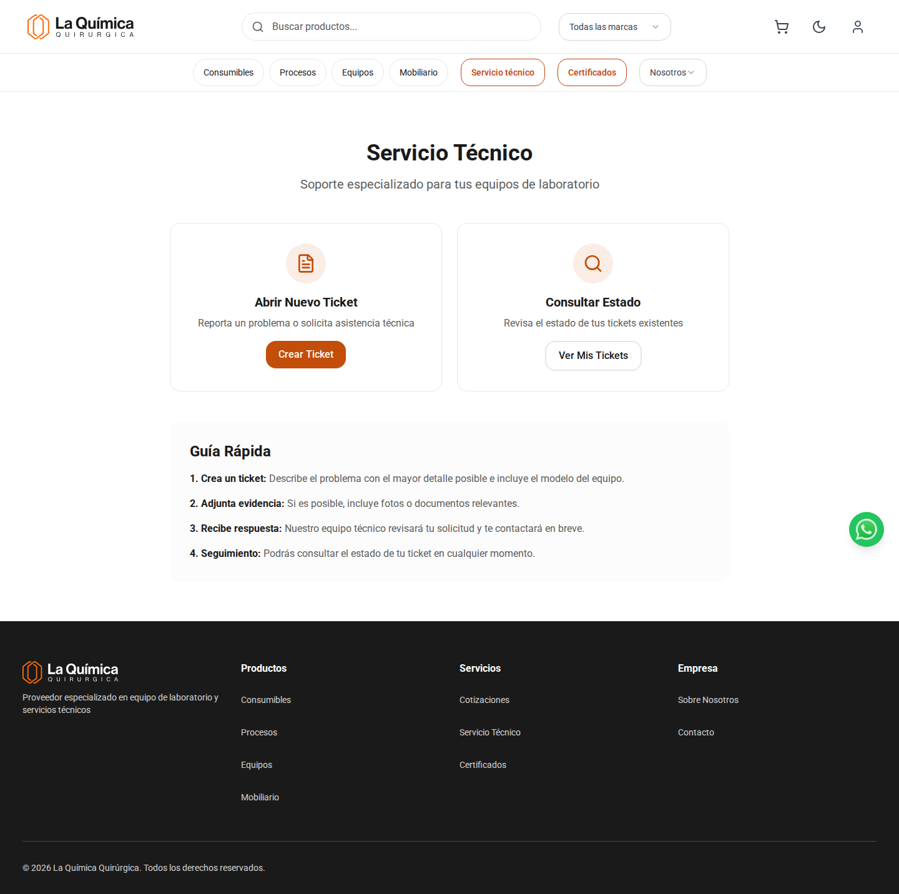

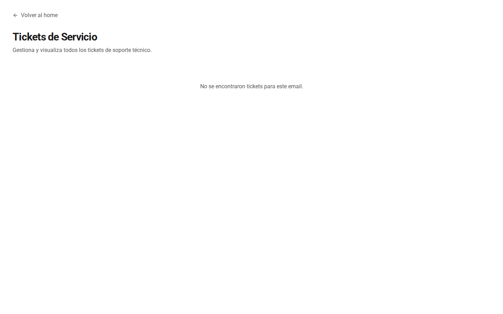

**Permisos:** cualquiera puede crear ticket desde la web; un usuario `client` solo ve los suyos.

---

## A.7 Certificados (CoA)

**Objetivo:** buscar certificados de análisis (Fisher Scientific / Solstice).

1. Ir a `/certificates` (**Búsqueda de Certificados**).
2. Elegir **Marca** (Fisher Scientific o Solstice).
3. Completar **Número de Artículo** y/o **Número de Lote** según marca.
4. Pulsar **Buscar Certificado**.

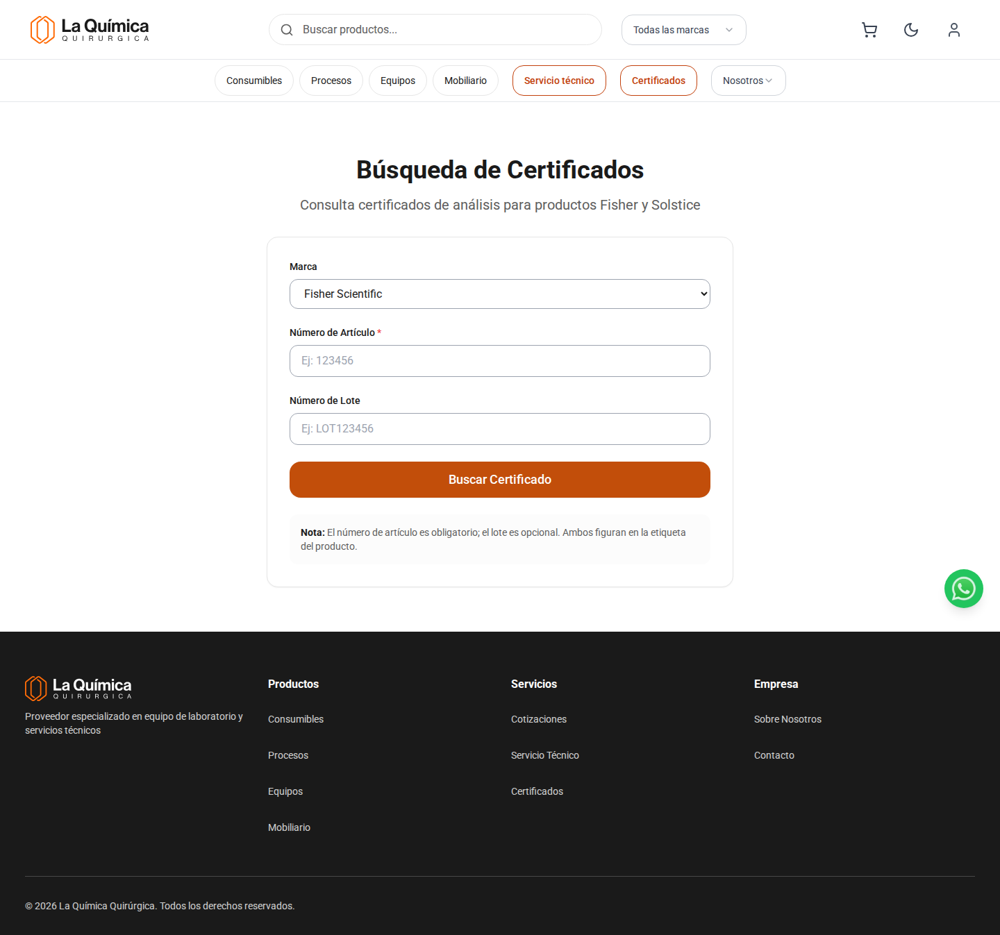

---

## A.8 Contacto

**Objetivo:** enviar un mensaje al equipo comercial/soporte.

1. Ir a `/contact`.
2. Completar **Nombre**, **Apellido**, **Empresa**, **País**, **Email**, **Teléfono** y mensaje.
3. Pulsar **Enviar Mensaje**.

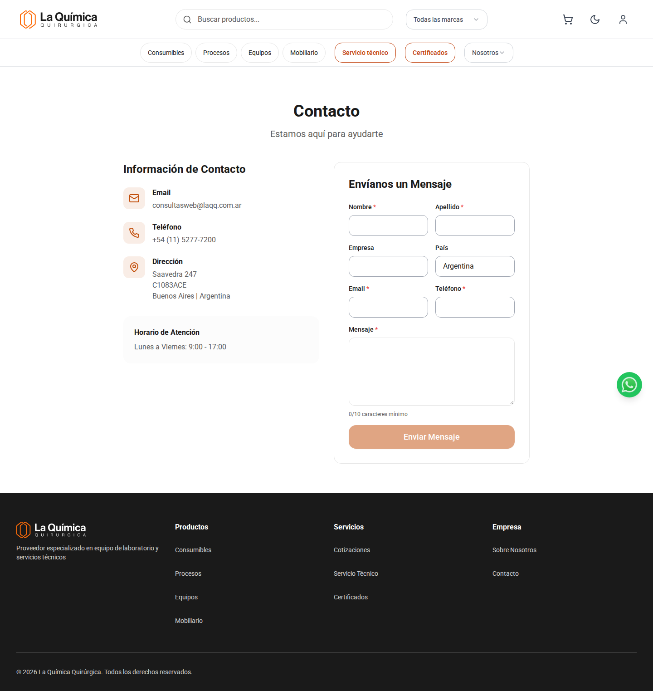

Los mensajes aparecen en backoffice → **Mensajes**.

---

## A.9 Empresa y mobiliario

**Objetivo:** contenidos institucionales y de mobiliario de laboratorio.

- `/company` — historia y líneas de solución (Equipos, Consumibles, etc.).
- `/furniture` — **Mobiliario para laboratorios** (gabinetes, ductos, campanas).

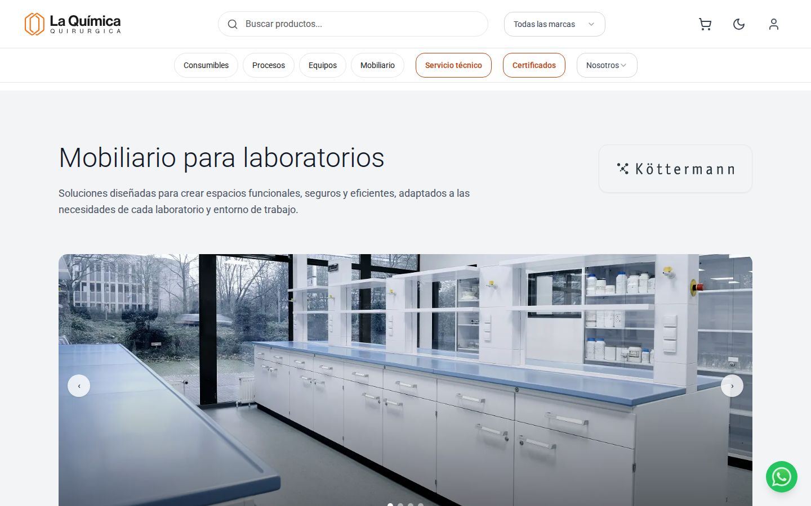

---

# B. Backoffice

Acceso: login → `/backoffice`. Menú lateral (labels reales del Sidebar).

## B.1 Dashboard

**Objetivo:** vista rápida del estado del sistema.

1. Entrar a `/backoffice`.
2. Revisar estadísticas (Usuarios activos, Productos, Cotizaciones, Mensajes nuevos) y **Accesos Rápidos**.

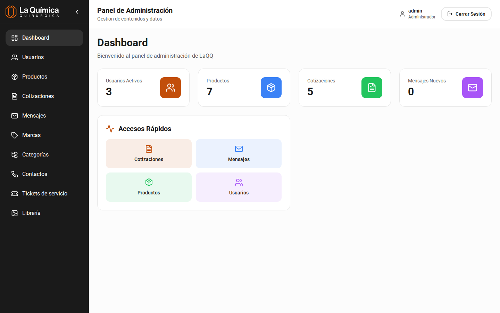

---

## B.2 Usuarios

**Objetivo:** ABM de usuarios del sistema.

1. Menú **Usuarios** → `/backoffice/users` (**Gestión de Usuarios**).
2. **Nuevo Usuario** → completar datos → **Crear**.
3. **Editar** / **Guardar** o **Eliminar** según necesidad.

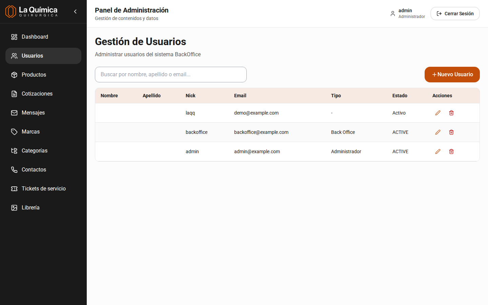

**Permisos:** crear/editar/eliminar solo **admin** (`useCanManageUsers`).

---

## B.3 Productos

**Objetivo:** mantener el catálogo (altas, ediciones, variantes/carga masiva según UI).

1. Menú **Productos** → **Gestión de Productos**.
2. **Nuevo Producto** o **Editar** / **Eliminar**.
3. Exportación Excel disponible para **admin** y **back** si el botón está visible.

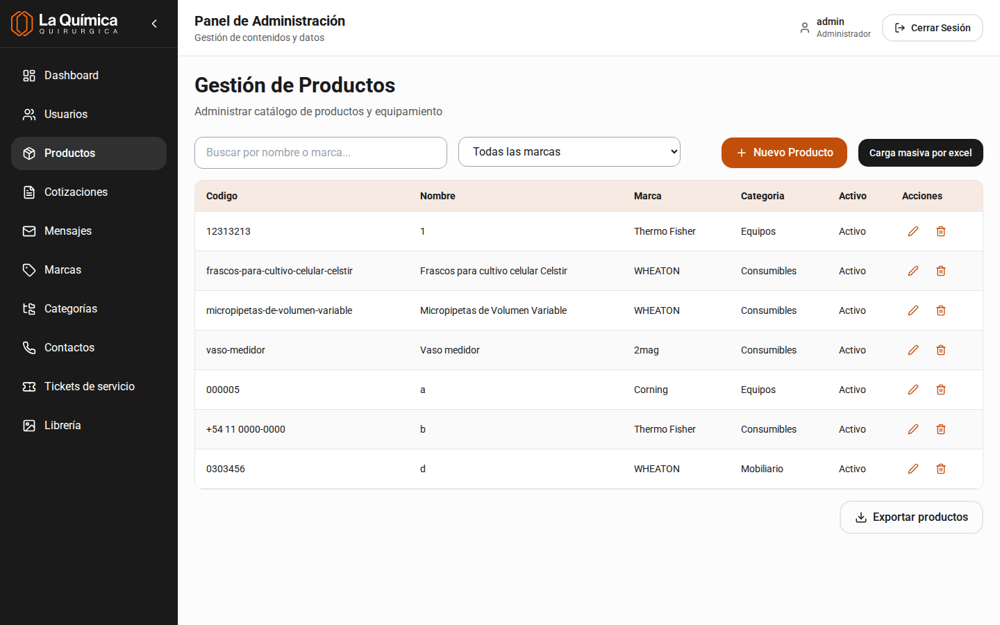

**Permisos:** escritura solo **admin**; **back** puede ver/exportar según hooks.

---

## B.4 Cotizaciones

**Objetivo:** gestionar solicitudes del sitio (equivalente operativo a “pedidos” comerciales).

1. Menú **Cotizaciones** → **Gestión de Cotizaciones**.
2. **Ver** / **Editar** una cotización; **Eliminar** si corresponde.
3. Acciones de envío/actualización según botones de la pantalla (p. ej. reenvío al cliente).

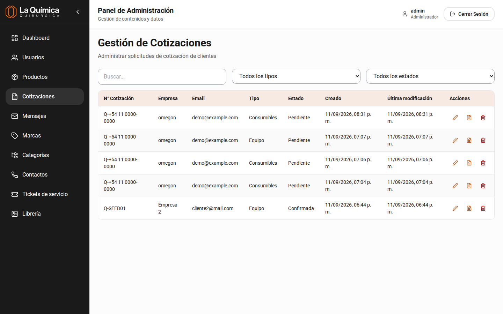

**Permisos:** **admin** y **back** pueden gestionar.

---

## B.5 Mensajes

**Objetivo:** revisar mensajes del formulario de contacto.

1. Menú **Mensajes** → **Administrador de Mensajes**.
2. Filtrar **Nuevos** si hace falta.
3. **Eliminar** (solo admin).

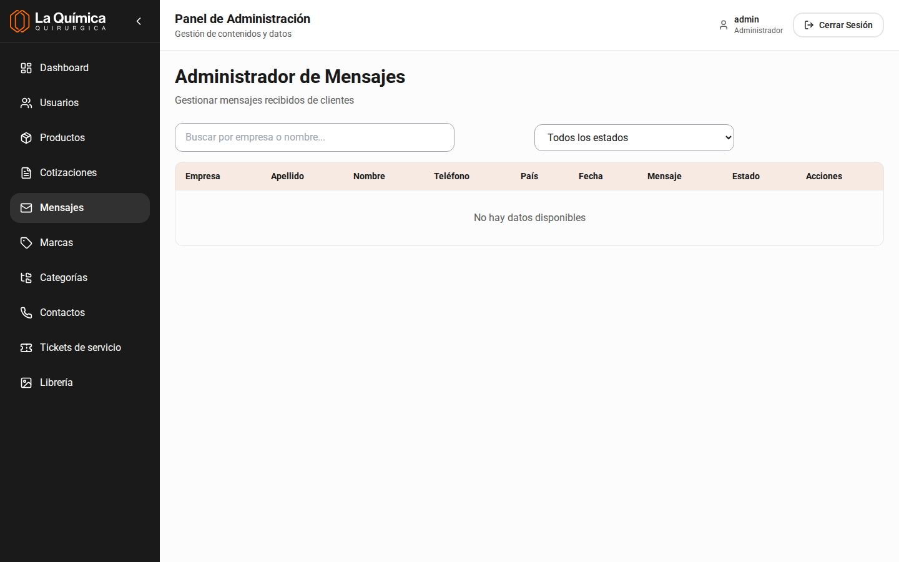

---

## B.6 Marcas

**Objetivo:** ABM de marcas del catálogo.

1. Menú **Marcas** → **Gestión de Marcas**.
2. **Nueva marca** / **Editar** / **Eliminar**.

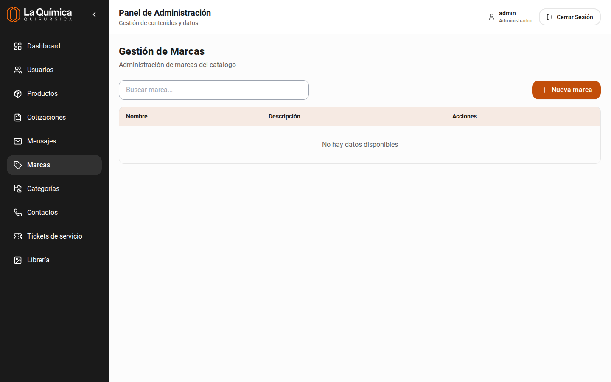

**Permisos:** manage solo **admin**.

---

## B.7 Categorías

**Objetivo:** mantener el árbol de categorías.

1. Menú **Categorías** → **Gestión de Categorías**.
2. **Nueva Categoría** / **Editar** / **Eliminar**.

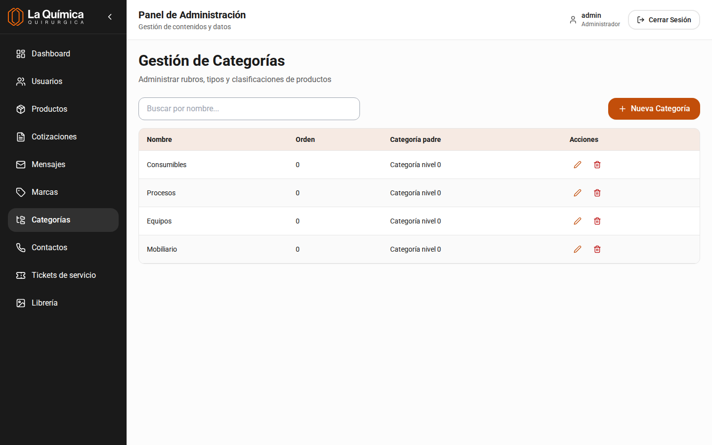

**Permisos:** manage solo **admin**.

---

## B.8 Contactos

**Objetivo:** CRM ligero de contactos.

1. Menú **Contactos** → **Gestión de Contactos**.
2. **Crear contacto** (**admin** y **back**).
3. **Editar** / **Eliminar** (solo **admin**).

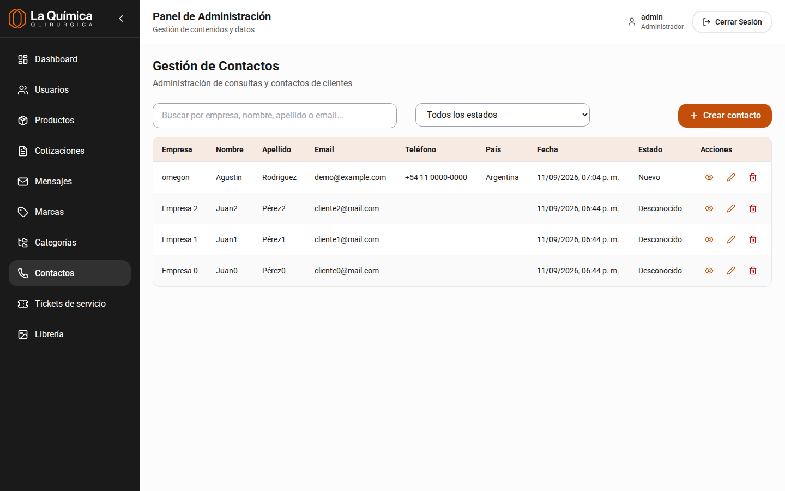

---

## B.9 Tickets de servicio

**Objetivo:** operar tickets de servicio técnico desde el staff.

1. Menú **Tickets de servicio** → **Gestión de tickets de servicio**.
2. Consultar listado; **Editar** / **Eliminar** según permisos.
3. Acciones de workflow (asignar, iniciar, resolver, cerrar): solo **admin**.
4. **back** puede ver y adjuntar archivos, no ejecutar el workflow de cierre/asignación.

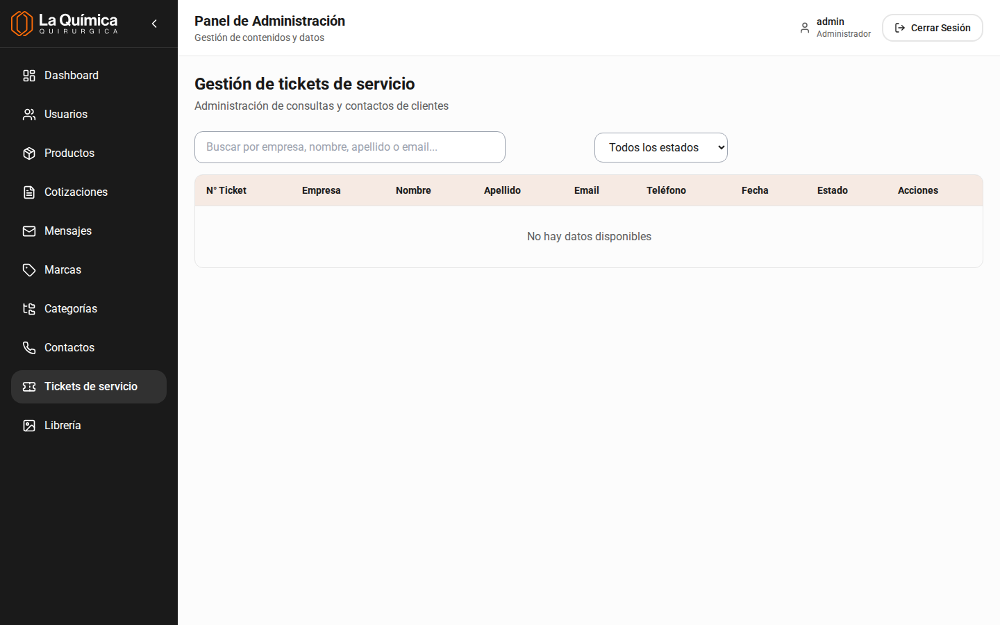

---

## B.10 Librería

**Objetivo:** gestionar imágenes y archivos reutilizables.

1. Menú **Librería**.
2. Usar **Buscar archivos...** para filtrar.
3. **Cargar archivos** (estado *Subiendo...* mientras procesa).

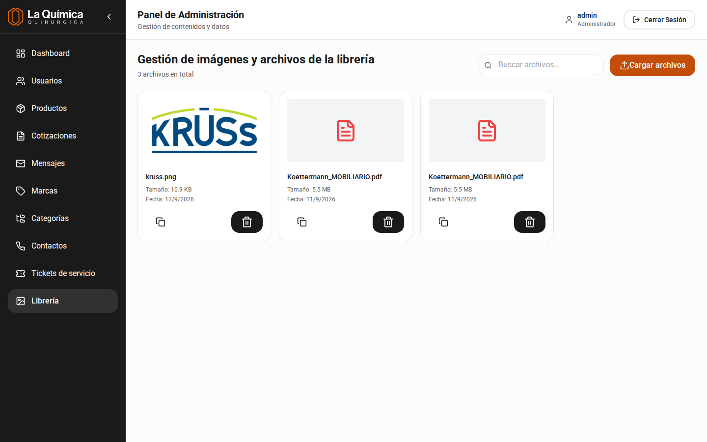

**Permisos:** alta/baja de adjuntos de galería solo **admin**.

---

## C. Funciones fuera del menú / no documentadas como producto

| Ítem | Estado |
|------|--------|
| Notas (`/backoffice/notes`) | Ruta existe; ítem de menú comentado |
| Complementary (states, types, levels, rrhh, accessories) | Rutas existen; menú comentado |
| Pedidos / facturación | **No implementado** |

---

## Referencias

- Rutas: `Frontend/src/App.tsx`
- Menú: `Frontend/src/components/layout/Sidebar.tsx`
- Permisos UI: `Frontend/src/hooks/usePermissions.ts`
- Arquitectura: `docs/MANUAL_ARQUITECTURA.md`
- Deploy: `docs/MANUAL_DEPLOY.md`
